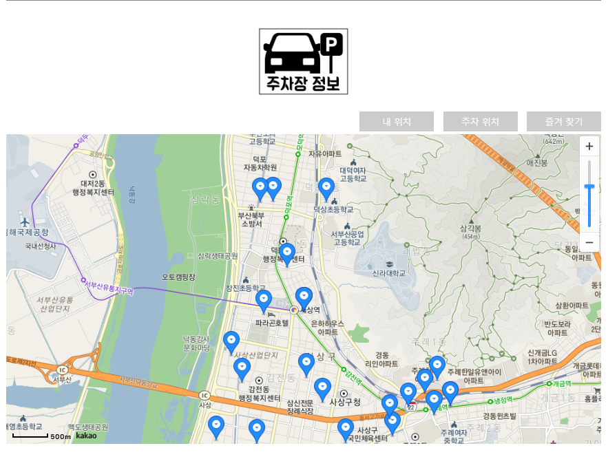

#  우아한 주정차 

## 1. 프로젝트 

- 위치정보를 기반으로 지도  API 및 공공데이터를 활용하여 이용자에게 주정차 정보를 제공
- 기존에 구현된 주차장 정보앱들과는 다르게 주차장 정보뿐 아니라 주정차 금지구역 정보를 함께 구현

## 2. 프로젝트 구현

## 3.화면 구성

#### 3.1 메인화면

#### 3.2 메인화면(공지사항)

#### 3.3 주차장 정보

#### 3.4 내 위치

#### 3.5 주차위치 지정

#### 3.6즐겨찾기

#### 3.6 코멘트 기능

#### 3.7 주정차 금지구역

#### 3.8 주정차 정보 단속 현황

#### 3.9 주정차 가능(주, 야간)

#### 3.10

## 4. 사용기술

•	사용기술

–	Java, SpringFramework, Mybatis

–   Javascript, Jquery(ajax). Html, CSS 

–	Apache tomcat / Oracle 

 

•	오픈 API 및 자료

–	카카오 맵 API

–	공공데이터 포털

•	주차장 정보

•	주정차 금지(지정)구역

•	불법주정차 단속현황

•	거주자우선 주차정보